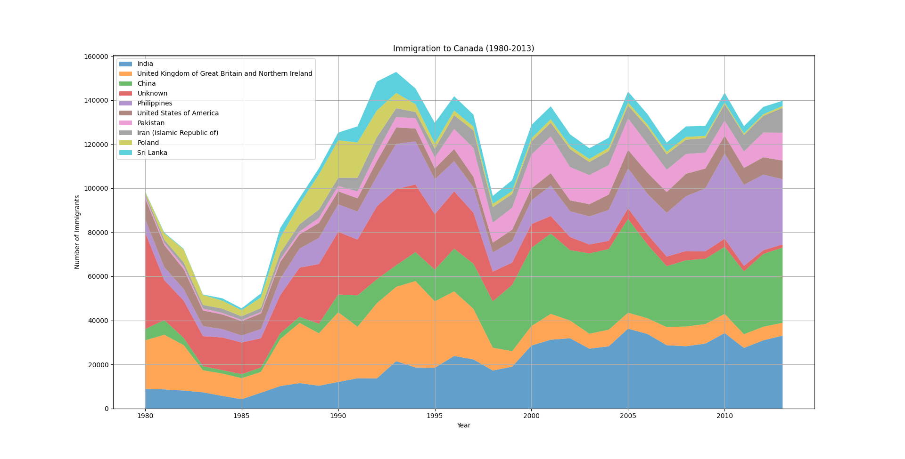

## Data Analyst
**Highly skilled and analytical Data Analyst with over three years of experience in data reporting, auditing, and analysis. Proven track record of leveraging Python, SQL, and Power BI to develop automated solutions and visualizations that enhance data integrity and optimize business processes. Demonstrated ability to extract, analyze, and interpret complex data sets to drive actionable insights and support strategic decision-making.**
  
## Projects
An example of data visualization (an area graph) representing annual immigration rates to Canada from 10 counties with the highest cumulative rates over the period between 1980 and 2013.  
_(Can be reproduced via a function included in the "visualization exercise" available in the GitHub portfolio)_  

  
## Education 
**University of York, York, United Kingdom**  
Bachelor of Engineering - BEng Elecronics Engineering wih Music Technology Systems  
_Oct 2018 - Aug 2021_  
Grade: 1st class degree (GPU: 4.0)  
  
  
## Work Experience
**Colt Technology Services**  
**Billing Reporting Analyst (Audit)**  
_Apr 2024 - Present_  
_Poznań, Poland_  
- Developed a web scraper in **Python**  using Selenium to automate audits, comparing data between **SQL** databases and **Excel** files related to ordering, ticketing, and billing systems.
- Completed audits and checks to identify errors and defects, enhancing data integrity.
- Utilized **Power BI** for comprehensive reporting and data visualization.
- Traversed SQL databases to extract relevant data for audits. 
- Improved existing billing and audit processes, resulting in increased efficiency.
- Conducted decomposition on credits and backbills for accurate financial reporting.
  
**Lumen Technologies / Colt Technology Services**  
(Lumen EMEA was acquisition by Colt Technology)  
**Off-net quoation analyst 1**  
_May 2023 - Apr 2024_  
_Poznań, Poland_  
- Developed a custom statistical tool in **JavaScript** to visually break down processed requests from CSV files, improving analysis efficiency.
- Selected quotations that best met project requirements, ensuring optimal pricing and terms.
- Reviewed orders before submission to local vendors and coordinated quote orders for leased lines across various carriers.
- Collaborated with the CRMs team to attain vendor standard rates, meeting deadlines for all requests.
  
**McKinsey & Company**  
**Junior CRM Analyst**  
_Poznań, Poland_  
_Oct 2022 - Apr 2023_  
- Assisted in building and maintaining cell databases **(Salesforce, Access)**, contributing to overall database optimization.
- Managed online CRM systems (Vuture, Marketo) to execute email campaigns effectively.
- Provided customized reports and conducted ad hoc statistical analyses to support strategic initiatives.
- Managed multiple projects and deadlines with minimal oversight.
  
**McKinsey & Company**  
**Executive Assistant**  
_Poznań, Poland_  
_Jul 2021 - Oct 2022_  
- Managed logistics for client projects, ensuring seamless operations.
- Handled complex, sensitive, time-critical tasks and quickly acclimated to unfamiliar topics.
- Organized and scheduled international meetings across multiple time zones while providing broad administrative support.
- Planned and organized travel arrangements while managing confidential data.
  
## Licenses & Certifications
**Data Analysis with Python from _IBM_**  
Skills: Data Cleaning · Exploratory Data Analysis · Statistics · Pivot Tables · Python (Programming Language) · ANOVA · Correlation Analysis · Seaborn · Scikit-Learn · Linear Regression · Regression Analysis · Regression Models · Pipelines · Variance Analysis · Model Development  
  
**Python for Data Science from _IBM_**  
Skills: Python (Programming Language) · Data Analysis · Data Science · Application Programming Interfaces (API) · REST APIs · NumPy · JSON · Pandas (Software)  
  
  
## Skills
**Data Analysis:**  
Python (Programming Language), MatLab, SQL, Microsoft Access, Salesforce.com, Microsoft Excel, Pricing Analysis, Snowflake, Research Skills, Performance Metrics, Microsoft Power BI, JSON, NumPy, Pandas (Software), Model Development, Variance Analysis, Pipelines, Regression Analysis, Scikit-Learn, Seaborn, Correlation Analysis, ANOVA, Pivot Tables, Expploratory Data Analysis, Data Cleaning, VBA  
  
**Programming:**  
Python (Programming Language), C, VHDL, Selenium, JavaScript, Swift 
  
**Technical Skills:**  
Telecommunications Systems, Technology Research, Web Scraping  
  
**Financial Skills:**  
Invocie Processing, Budgeting, Billing Systems, Reporting & Analysis  
  
**Soft Skills:**  
Problem Solving, Communication, Supplier Negotiation  
  
**Languages:**  
Polish (native), English (C2)  
